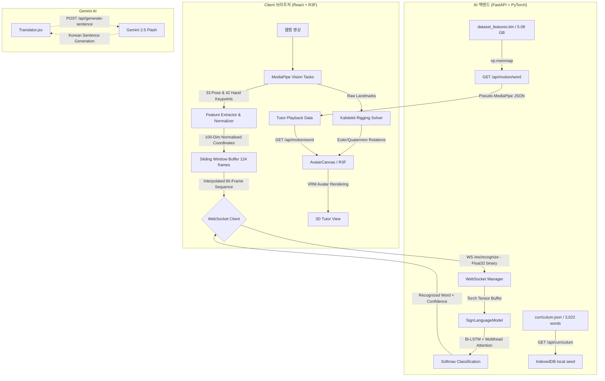

# 🖐️ SignLingo: AI-Based Sign Language 3D Tutor & Translator

SignLingo는 영상 시청 중심의 기존 수어 학습이 가진 한계를 극복하기 위해 설계된 **AI 기반의 양방향 3D 수어 학습 및 실시간 번역 플랫폼**입니다. 
웹 브라우저 상에서 AI 모델이 사용자의 카메라 모션을 실시간으로 분석하고(Continuous Gesture Spotting), 3D 캐릭터 아바타가 표준 수어를 다각도에서 자연스럽게 시연하여 상호작용 학습 효과를 극대화합니다.

---

## 📌 주요 특징 (Key Features)

1. **3D 아바타 수어 시연 (Sign Language 3D Tutor)**
   * WebGL 기반의 3D 환경에서 VRM 아바타가 실시간으로 수어 동작을 시연합니다.
   * 사용자는 카메라 뷰를 360도 회전, 확대/축소하여 손가락 관절과 손목의 입체적 위치를 정교하게 학습할 수 있습니다.
   * `Kalidokit` 기반의 Kinematics Solver를 사용하여 부드러운 관절 보간(Slerp/Lerp) 및 표정 시연이 가능합니다.

2. **실시간 모션 인식 및 피드백 (Real-time Motion Feedback)**
   * 브라우저 내에서 MediaPipe(Pose 및 Hands)를 활용하여 50개의 골격 포인트(100차원 피처)를 실시간으로 추출합니다.
   * AI 서버가 백그라운드에서 실시간 WebSocket 통신으로 데이터를 받아 PyTorch 기반의 시계열 딥러닝 모델로 모션을 분석합니다.
   * 타겟 단어 일치 여부를 실시간으로 판별하여 즉각적인 시각적 피드백을 제공합니다.

3. **실시간 연속 번역기 (Continuous Translator)**
   * 단어 단위 인식을 넘어 카메라 앞에서 계속해서 수어 동작을 수행하면 슬라이딩 윈도우(`BUFFER_SIZE=124`, `WINDOW_STRIDE=15`) 구조를 통해 연속적으로 수어 단어 흐름을 번역합니다.
   * 중복 인식을 방지하기 위한 쿨다운 시스템이 적용되어 단어가 차례대로 텍스트 문장으로 축적됩니다.

4. **강력한 수어 제작 도구 (CMS Authoring Tool)**
   * 챕터와 수어 단어(레슨) 메타데이터를 관리할 수 있습니다.
   * 카메라를 활용하여 3D 아바타 시연용 모션 데이터를 직접 녹화하고 IndexedDB에 누적 저장할 수 있는 툴을 포함합니다.

5. **AI 허브 대용량 데이터 전처리 및 학습 파이프라인**
   * AI 허브 수어 영상 데이터셋(OpenPose keypoint ZIP 아카이브 파일들)을 직접 병합하여 초고속 학습용 이진 파일(`dataset_features.bin`, 약 5GB)과 인덱싱 캐시(`dataset_cache.pkl`)로 가공하는 견고한 전처리 파이프라인을 내장하고 있습니다.

---

## 🛠️ 기술 스택 (Tech Stack)

### Frontend
* **Core:** React 18, Vite, Javascript
* **3D Rendering:** React Three Fiber (R3F), `@react-three/drei`, `@pixiv/three-vrm` (VRM 표준 아바타 구동)
* **Computer Vision & Tracking:** `@mediapipe/tasks-vision` (Pose & Hand Landmarker)
* **Kinematics Solver:** `Kalidokit` (MediaPipe 랜드마크 → VRM Bone 쿼터니언 변환)
* **Database & Seed:** Browser IndexedDB (Local Seeding via FastAPI curriculum endpoint)
* **Styling:** Vanilla CSS, TailwindCSS (일부 레이아웃 및 컴포넌트)
* **Icons:** `lucide-react`

### Backend
* **Web Framework:** FastAPI, WebSocket
* **Deep Learning Engine:** PyTorch (Inference & Training)
* **Numerical Processing:** NumPy (`memmap` 적용으로 5GB 대용량 모션 데이터를 RAM 점유 없이 디스크에서 초고속 매핑)
* **NLP & Sentence Generator:** Google GenAI SDK (Gemini 2.5 Flash API 활용)

---

## 🏗️ 시스템 아키텍처 (System Architecture)



---

## ⚠️ 중요: 필수 대용량 바이너리 별도 설정 (Required Binary Setup)

본 리포지토리는 AI 모델 가중치 파일(`sign_model_best.pth`, `sign_model.pth`)과 데이터셋 메타 인덱스 캐시(`dataset_cache.pkl`)를 **기본적으로 깃 추적에 포함하여 제공**합니다. 따라서 실시간 웹캠 인식 기능은 복제(Clone) 즉시 사용 가능합니다.

단, 3D 아바타 수어 시연(Tutor 모드) 재생에 필요한 대용량 모션 바이너리 파일인 **`Signlingo_backend/backend/dataset_features.bin` (5.08 GB)은 깃 추적에서 제외(`.gitignore`)**되어 있습니다. 이 3D 모션 기능을 활성화하려면 **GitHub Releases** 탭에서 해당 파일을 직접 받아 아래 경로에 위치시켜야 합니다.

### 📦 GitHub Releases 업로드 및 복원 방법 (무료 용량 제한 우회)
GitHub Releases 업로드 시 무료 계정은 파일당 최대 **2 GB**의 업로드 제한이 있습니다. 따라서 5GB인 `dataset_features.bin`을 업로드하고 복원하기 위해 **파일 분할 및 병합** 방식을 사용합니다.

#### 1. 파일 분할 (릴리즈 업로드용 - 사용자 louis1618 실행)
백엔드 폴더(`Signlingo_backend/backend/`)에서 터미널을 열고 아래 파이썬 명령어를 실행하여 5GB 바이너리를 1.5GB 크기(2GB 이하)의 4개 파트로 쪼갭니다:
```bash
python -c "import os; f=open('dataset_features.bin','rb'); [open(f'dataset_features.bin.part{i}','wb').write(f.read(1500*1024*1024)) for i in range(4)]; f.close(); print('Split complete!')"
```
* 생성된 `dataset_features.bin.part0`, `part1`, `part2`, `part3` 파일들을 **GitHub 저장소의 Releases 탭**에 Assets로 업로드합니다.

#### 2. 파일 병합 (다운로드 및 복원용 - 타 개발자 실행)
다른 컴퓨터에서 프로젝트를 실행하는 경우, GitHub Releases에서 4개의 파트 파일들을 모두 다운로드하여 백엔드 폴더(`Signlingo_backend/backend/`)에 넣은 후 아래 명령어로 병합하여 원본을 복원합니다:
```bash
python -c "import glob; parts=sorted(glob.glob('dataset_features.bin.part*')); f=open('dataset_features.bin','wb'); [f.write(open(p,'rb').read()) for p in parts]; f.close(); print('Merge complete!')"
```
* 병합이 완료되면 임시 다운로드한 `dataset_features.bin.part*` 파트 파일들은 안전하게 삭제해도 좋습니다.

---

### 방법 B. 로컬에서 데이터셋 직접 재구축
AI Hub 원본 키포인트 ZIP 파일들을 소지하고 있는 경우, 처음부터 데이터를 가공하고 직접 학습하여 파일을 생성할 수 있습니다.
1. AI Hub에서 다운로드한 `01_real_word_keypoint.zip.part*` 파일들을 `Signlingo_backend/` (혹은 지정한 작업 영역)에 위치시킵니다.
2. 백엔드 가상환경(`venv`) 활성화 후, 아래 스크립트를 차례로 실행합니다:
   ```bash
   # 1. OpenPose 데이터 병합 및 100차원 피처 바이너리/캐시 빌드
   python preprocess_stream.py
   
   # 2. 3D 아바타 재생용 pseudo-MediaPipe 궤적이 탑재된 curriculum.json 생성
   python preprocess_vrm.py
   
   # 3. AI 모델 학습 시작 (학습 완료 시 sign_model_best.pth 가 자동 빌드됨)
   python train.py
   ```

---

## 🚀 실행 방법 (Getting Started)

### Prerequisites
* **Python** 3.10 이상
* **Node.js** 18 이상

### 백엔드 실행 (Signlingo_backend)
1. 백엔드 디렉토리로 이동 및 가상환경 설정:
   ```bash
   cd Signlingo_backend/backend
   python -m venv venv
   .\venv\Scripts\activate
   ```
2. 종속성 패키지 설치:
   ```bash
   pip install -r requirements.txt
   ```
3. 백엔드 서버 구동 (※ 위의 대용량 바이너리 및 모델 가중치 파일 배치가 완료된 상태여야 합니다):
   ```bash
   python main.py
   ```
   * 백엔드는 `http://localhost:8000`에서 활성화되며 WebSocket 엔드포인트는 `ws://localhost:8000/ws/recognize`입니다.

### 프론트엔드 실행 (Signlingo_frontend)
1. 프론트엔드 디렉토리로 이동:
   ```bash
   cd Signlingo_frontend
   ```
2. NPM 패키지 설치:
   ```bash
   npm install
   ```
3. 개발용 Vite 서버 실행:
   ```bash
   npm run dev
   ```
   * 브라우저에서 `http://localhost:5173`으로 접속하여 테스트할 수 있습니다.

---

## 📊 AI 데이터셋 및 전처리 (Dataset & Preprocessing)

### 데이터셋 출처
* **AI 허브(AI Hub):** "수어 영상 데이터" 구축 과제의 데이터셋을 활용.
* 약 140GB 규모의 수어 단어 및 문장 키포인트 데이터셋으로 구성.
* 한국어 표준 수어 단어(단어 약 3,000개)를 대변하는 OpenPose 2D 스켈레톤 데이터.

### 데이터 전처리 방식 (Preprocessing Pipeline)
1. **분할 병합:** 압축파일 파트(.zip.part*)를 일원화된 ZIP 파일로 동적 병합 및 RAM 스트림 파싱.
2. **골격 선택 및 인덱싱:** OpenPose의 25개 포즈 랜드마크 중 상체 동작 및 어깨-손목 흐름에 영향을 미치는 8개 핵심 조인트와 양손 각각 21개의 조인트(총 50개 좌표점)만 필터링.
3. **Neck 중심 정규화:** 모든 프레임의 좌표를 `Neck` 좌표를 원점으로 평행 이동시켜 좌표 원점 불일치 해결.
4. **Torso 스케일링:** 신체 비율이나 카메라 거리에 구애받지 않도록 `torsoSize = EuclideanDist(RShoulder, LShoulder) / 0.68`로 X, Y 좌표를 나눔.
5. **시계열 길이 보간:** 임의 길이를 가진 수어 동작 프레임(평균 124프레임)을 `np.linspace`를 통해 60프레임으로 일정하게 보간(Interpolate)하여 균일한 시계열 텐서 구성.

---

## 🤖 AI 모델 및 알고리즘 (AI Model Architecture)

본 프로젝트는 수어의 강력한 시계열 동적 변화와 각 관절 간의 상관성을 극대화하기 위해 설계된 하이브리드 인공신경망 아키텍처를 채택했습니다.

* **Linear Projection Layer:** 100차원 입력 특징값을 512차원 은닉 차원으로 투영하고 레이어 정규화(LayerNorm) 및 드롭아웃(0.3)을 통해 초기 노이즈 제거.
* **Bidirectional LSTM (3-Layer):** 순방향 및 역방향으로 동작의 프레임 관계를 추적하여 수어의 시작과 끝 흐름을 양방향으로 보존 (은닉 차원 256 x 2 = 512).
* **Multi-head Self-Attention:** 프레임 시퀀스 전반에 걸쳐 가장 핵심적인 수어 동작 포인트가 위치한 구간의 특징을 가중 매핑 (8개 어텐션 헤드 채택).
* **Temporal Average Pooling & Classification Head:** 전체 시계열 은닉 상태를 시간축 평균 풀링하여 최종 아웃풋 분류 레이어를 통과시킴으로써 3,022개 단어 분류.

---

## 🔮 향후 계획 (Future Roadmap)

1. **프론트엔드 Gemini 번역 연동:** 수어 번역기 화면(`Translator.jsx`)에서 수집된 단어 흐름을 백엔드 `/api/generate-sentence` API와 연결하여 실제 매끄럽고 완벽한 문장 번역 UX 구현.
2. **Zustand 아키텍처 이관:** 실시간 수어 추적 시 프레임별 미세한 렌더링 갱신 오버헤드를 막기 위해 Zustand 전역 상태 관리 도입.
3. **얼굴 표정(BlendShape) 모델 적용:** 비수지 신호(눈썹 찌푸림, 입 벌림 등)가 중요한 수어 특성을 반영하기 위해 MediaPipe Face Mesh 및 VRM BlendShape 매퍼 추가.
4. **리더보드 및 게이미피케이션 완성:** 학습 몰입도 증진을 위해 Coming Soon으로 표시된 리더보드 및 마이 프로필 탭의 상세 기능 구현.
